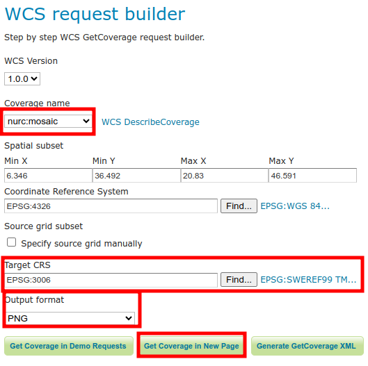

# Övning 1.1: Installera och ta i bruk

**Övningens innehåll**

Anslut till den befintliga GeoServer-servern via en webbläsare. Lär dig att redigera serverns allmänna information och att ställa in administratörens användarprofilinformation (användarnamn och lösenord).

**Övningens målsättning**

Efter övningen kan du logga in som administratör i GeoServer och har en grundläggande förståelse för dess användargränssnitt.

**Tid**

40 minuter.

## **Förberedelser**

Öppna en webbläsare på din dator.

På kursen använder vi servers via en molntjänst. Fråga kursledaren om din IP-adress och port.

Ifall du övar med en lokal installation av GeoServer så är din adress förmodligen

::: note-box
http://localhost:8080/geoserver
:::

Framför dig har du GeoServers användargränssnitt. Innan du loggar in kan du se några allmänna uppgifter om servern.

**Uppe till höger (1)** är inloggningsuppggifterna.

**Uppe i mitten (2)** är uppgifter om serverns arbetsytor (workspaces) och lager.

**Uppe till vänster (3)** är GeoServer-loggan och när man trycker på den så kommer man alltid tillbaka till den här sidan.

**Till vänster (4)** är huvudmenyn, därifrån man kan navigera till olika funktioner och inställningar.

**I mitten (5)** ser man vilka karttjänster (och vilka versioner) som servern stöder.

**Nere i mitten (6)** ser man vilken version av GeoServer som är installerad. På bilden är det version 2.22.4.

## **Huvudmenyn**

I huvudmenyn på startsidan visas endast några få funktioner. Dessa är synliga för alla som känner till serverns adress (URL).

-   **About & Status** -sektionen visar bara **About GeoServer**, som ger mer detaljerad information om GeoServer-installationen och länkar till GeoServers dokumentation. Versioninformation för GeoTools- och GeoWebCache-programvarorna kan du också kontrollera på denna sida.

-   Under **Data**-sektionen finns **Layer Preview**, där man kan förhandsgranska lager som finns på servern.

-   **Demos**-sektionen innehåller några karttjänster man kan testa.

Bekanta dig en stund med de olika menyer och deras innehåll. Fråga kursledaren om det är något du undrar!

### **About GeoServer**

Öppna **About GeoServer** och ta reda på vilken GeoServer-version du har och vilka versioner de andra installerade programmen har. Dessa uppgifter kan vara väldigt viktiga när man försöker lösa problem som uppstått på servern. Ifall ber om hjälp, till exempel via Gispos supporttjänst, så är det första vi frågar vilken version du använder.

### **Layer Preview**

Testa **Layer Preview**-funktionen och förhandsgranska GeoServers standarddata. Denna vy kommer vi att använda ofta under kursens gång. Ta nu några minuter för att lära dig dess grundläggande funktioner.

### **Geodatatjänster**

Klicka på**GeoServer-loggan** för att komma tillbaka till framsidan.

Innan du loggar in på servern kan du se vilka geodatatjänster som är möjliga att publicera med den aktuella installationen av GeoServer.

På servern för övningen är WCS, WFS, WMS, TMS, WMS-C och WMTS installerade som standard. Andra geodatatjänster, såsom till exempel WPS-tjänsten, kan publiceras i GeoServer med hjälp av tillägg. Genom att klicka på geodatatjänsternas versionsnummer kan du lära dig mer om deras funktioner (capabilities).

Detta avsnitt är endast synligt på startsidan. Kom ihåg att du alltid kan komma tillbaka till startsidan genom att klicka på GeoServer-loggan.

### **Demos**

Under denna meny hittar du några av GeoServers testverktyg.:\

### **Demo requests**

Testa olika frågekommandons (funktioners) resultat och se vad varje frågekommando ger. Testa funktionen för WMS_getMap_OpenLayers.url genom att välja det frågekommandot från menyn och trycka på Submit-knappen.

GeoServers olika funktioner och operationer baseras på URL-parametrar. Parametrarna styr GeoServerns geodatatjänster: vilket kartlager som efterfrågas, vilket områdes informations som hämtas eller hur bilden skapas, o.s.v.

Ändra parametrarna BBOX, WIDTH och HEIGHT i frågan. Vad är händer av dessa ändringar på svaret?

## **SRS List och Reprojection console**

SRS List-funktionen listar de koordinatsystem som stöds av GeoServer. GeoServer innehåller de flesta av de tillgängliga koordinatsystemen, dvs. CRS (Coordinate Reference System). SRS (Spatial Reference System) är ett synonymt begrepp för CRS.

Du kan testa konversioner och omvandlingar mellan koordinatsystem med hjälp av Reprojection Console-funktionen.

Koordinaterna presenteras i WKT-format (Well Known Text).

I följande bild finns en punkt definierad i koordinatsystemet EPSG:3006. Du kan konvertera punkten till ett annat koordinatsystem, t.ex. WGS84 (EPSG:4326).

 **411957.87333196297 6351985.116206663**:

## **WCS request builder**

Med den här funktionen kan du testa hur Web Coverage Service-tjänsten fungerar.

Välj **nurc:mosaic**-lagret som PNG-fil i det nationella koordinatsystemet (**SWEREF99 TM** (EPSG 3006)). Du kan ignorera övriga inställningar:

Välj sedan  **Get Coverage in New Page**.
