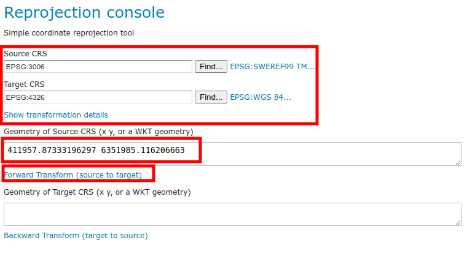

# HARJOITUS 1.1: ASENNUS JA KÄYTTÖÖNOTTO

**Harjoituksen sisältö**

Olemassa olevaan GeoServer-palvelimeen otetaan yhteys web-selaimen kautta. Opitaan muokkaamaan palvelimen yleistietoja ja asettamaan ylläpitäjän käyttäjäprofiilitiedot (tunnus ja salasana).

**Harjoituksen tavoite**

Harjoituksen jälkeen opiskelija osaa kirjautua ylläpitäjänä GeoServeriin ja tuntee yleisellä tasolla sen käyttöliittymän.

**Arvioitu kesto**

40 minuuttia.

## **Valmistautuminen**

Käynnistä koneessa web-selain.

Jos käytössä on etäpalvelin, kysy oma ip-osoitteesi ja portti kurssin vetäjältä.

Mikäli harjoittelet paikallisella GeoServer-asennuksella niin osoite on todennäköisesti

::: note-box
http://localhost:8080/geoserver
:::

Edessäsi on GeoServerin käyttöliittymä. Ennen kun kirjaudut sisään, näet muutamia yleisiä tietoja palvelimesta.

**Ylhäällä oikealla (1)** on kirjautumistiedot.

**Ylhäällä keskellä (2)** on tietoja palvelimen workspaceista ja tasoista.

**Ylhäällä vasemmalla (3)** on GeoServer-logo ja kun sitä painaa niin pääsee tähän etusivulle.

**Vasemmalla (4)** on päävalikko jonka kautta hallitaan ja tarkastellaan palvelimen toimintoja.

**Keskellä (5)** on palvelimen tukemat karttapalvelut ja niiden versiot.

**Alhaalla keskellä (6)** näkyy asennetun GeoServerin versionumero, joka on kuvassa 2.22.4.

## **Päävalikko**

Päävalikossa on näkyvissä aloitussivulla vain muutamia toimintoja. Nämä ovat nähtävissä kaikille, jotka tietävät palvelimen osoitteen (URL).

-   **About & Status** -osio tarjoaa vain **About GeoServer** -valinnan, joka kertoo tarkemmin GeoServerin asennuksen tietoja ja antaa linkkejä GeoServerin dokumentaatioon. GeoTools- ja GeoWebCache-ohjelmistojen versiotiedot voit tarkistaa myös tältä sivulta.

-   **Data**-osiossa on **Layer Preview** -valinta, jonka avulla voidaan esikatsella palvelimella julkaistuja tasoja (layers).

-   **Demos**-osion kautta voi tutustua muutaman karttapalvelutyypin toimintaan.

Tutustu niihin lyhyesti nyt, ja kysy kouluttajalta mitä eri elementit tarkoittavat.

### **About GeoServer**

Avaa **About GeoServer** ja tutki, mikä GeoServer-versio sinulla on käytössä ja mitkä muiden asennettujen ohjelmistojen versiot ovat. Tämäntyyppiset tiedot ovat tärkeitä palvelimen ongelmia selvitettäessä, tapahtuipa ongelmatilanteiden ratkaiseminen omatoimisesti taikka tukipalvelun avulla.

### **Layer Preview**

Kokeile **Layer Preview -toimintoa** ja esikatsele GeoServerin oletusaineistoja. Tätä näkymää tulemme käyttämään usein kurssin aikana. Käytä nyt muutama minuutti oppiaksesi sen perustoiminnallisuudet.

### **Palvelutoiminnallisuudet**

Palaa palvelimen pääsivulle painamalla **GeoServer-logoa**.

Ennen kun kirjaudutaan palvelimelle voit nähdä, mitä rajapintapalveluita käytössä olevalla GeoServerin asennuksella on mahdollista julkaista.

Harjoituksen GeoServerille on asennettu oletuksena WCS, WFS, WMS, TMS, WMS-C ja WMTS. Muita rajapintapalveluita, kuten esimerkiksi WPS-palvelu, voidaan julkaista GeoServeriin laajennosten avulla. Painamalla rajapintapalvelujen versionumeroita, voit tutustua niiden toiminnallisuuksiin (capabilities).

Tämä osio on nähtävissä vain aloitussivulla. Muista, että aloitussivuun pääset aina painamalla GeoServer-logoa.

### **Demos**

Tämän valikon alta löytyy muutamia GeoServerin testityökaluja:\

### **Demo requests**

Kokeile erilaisten kyselyjen (toiminnallisuuksien) tuloksia ja näe, mitä kukin kyselykomento tuottaa. Kokeile **WMS_getMap_OpenLayers.url**-kyselyn toimivuutta valitsemalla kyseinen kysely valikosta ja paina **Submit**-toimintoa.

GeoServerin eri toiminnot ja operaatiot muodostuvat URL:n liittyvistä parametreistä. Parametrit ohjaavat Geoserverin rajapintapalveluita: mitä karttatasoa kysytään, miltä alueelta tietoja haetaan tai kuva muodostetaan, vastauksen koordinaattijärjestelmä jne.

Muokkaa kyselyn parametrejä BBOX, WIDTH ja HEIGHT. Mitä vaikutuksia muutoksilla on vastaukseen?

## **SRS List ja Reprojection console**

SRS List -toiminto listaa Geoserverin tukemat koordinaattijärjestelmät. Geoserver sisältää suurimman osan käytettävistä koordinaattijärjestelmistä eli CRS:t (Coordinate Reference System). SRS (Spatial Reference System) on synonyymi CRS:lle.

Koordinaattijärjestelmien välisiä muunnoksia ja konversioita voit kokeilla Reprojection Console-toiminnon avulla.

Koordinaatit esitetään WKT-formaatissa (Well Known Text).

Seuraavassa kuvassa on piste geometria määritelty WKT-formaatissa EPSG:3067 koordinaattijärjestelmässä **POINT (522800 7615630)**:

Voit myös kokeilla ETRS89 / TM35FIN viivageometriaa. Löydät esimerkkitiedoston koulutuskansiosta nimellä **esimerkki_wkt_geometry_3067.txt**. Avaa se tekstieditorissa ja käytä sitä **Reprojection console** -työkalussa. Kokeile muuntaa se esimerkiksi WGS 84 -järjestelmään.

## **WCS request builder**

Tämän toiminnon avulla voit kokeilla Web Coverage Service -palvelun toimivuutta.

Lataa **nurc:mosaic**-aineisto PNG-tiedostona Suomen kansallisessa koordinaattijärjestelmässä (**ETRS89/TM35FIN** (EPSG 3067)). Jätä muut asetukset oletusarvoiksi:

Paina lopussa **Get Coverage**.
