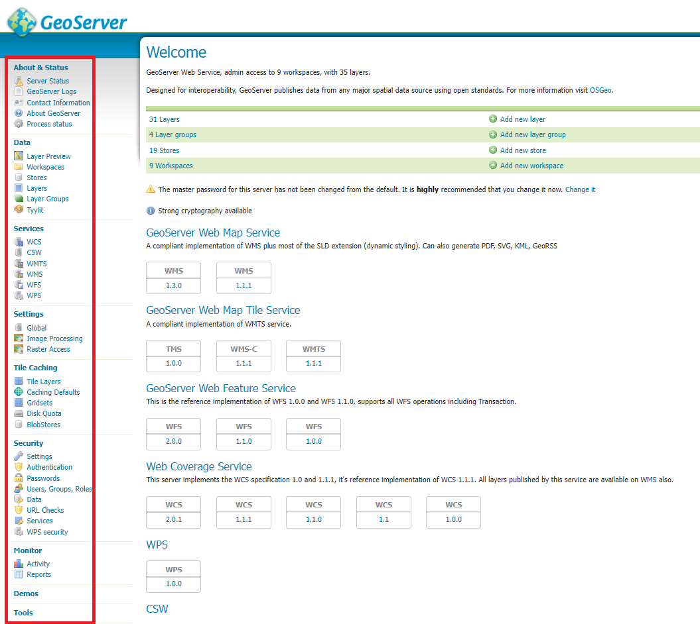
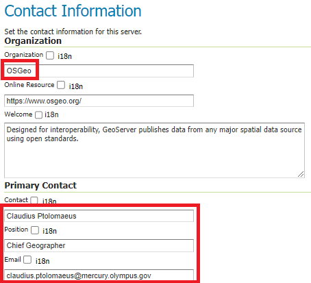
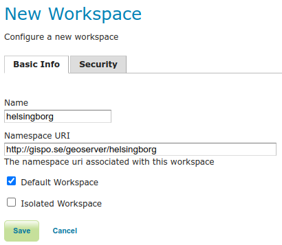
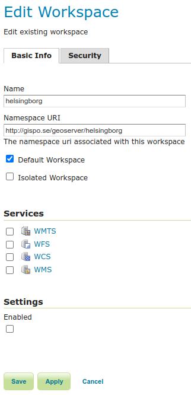

# ÖVNING 1.2: GEOSERVERS ANVÄNDARGRÄNSSNITT

**Övningens innehåll**

I övningen kommer vi att bekanta oss närmare med GeoServers huvudfunktioner genom användargränssnittet. Vi går igenom huvudmenyn och de viktigaste funktionerna i de olika delarna.

**Övningens syfte**

Efter övningen kommer du att förstå hur GeoServer fungerar och ha kunskap om de olika sektionernas verktyg.

**Tid**

35 minuter.

## **Förberedelser**

I den föregående övningen gick vi igenom några av menyerna i GeoServers. Användningen av dessa menyer och funktioner krävde ingen inloggning. I denna övning loggar vi in i GeoServers användargränssnitt som administratörer, vilket ger oss tillgång till fler menyer och funktioner.

## **Administratörens användargränssnitt**

Hittills har användargränssnittet endast visat öppna funktioner och data (utan inloggning). Dessa kan begränsas individuellt genom olika åtkomstkontrollinställningar. Vi kommer att bekanta oss med grunderna i åtkomstkontroll senare under kursen.

Logga in på servern som administratör med användaren **admin** och lösenordet **gispo**.

Administratörsvyn liknar den tidigare visade användargränssnittet. Den har samma struktur, men erbjuder betydligt fler funktioner och visningsalternativ.

GeoServers funktioner i huvudmenyn är grupperade efter deras användningsområden:

+--------------------------+----------------------------------------------------------------------------+
| ##### **About & Status** | Här finns allmän information om GeoServerinstallationen och dess status    |
+--------------------------+----------------------------------------------------------------------------+
| ##### **Data**           | Här laddar man upp data, hanterar lager och redigerar kartstilar 
+--------------------------+----------------------------------------------------------------------------+
| ##### **Services**       | Här kan du konfigurera olika geodatatjänster        
+--------------------------+----------------------------------------------------------------------------+
| ##### **Tile Caching**   | Här finns inställningar för GeoWebCache                                    
+--------------------------+----------------------------------------------------------------------------+
| ##### **Security**       | Här finns inställningar för åtkomsthantering                               
+--------------------------+----------------------------------------------------------------------------+
| ##### **Demos**          | Här finns Demo-funktioner för att testa GeoServer-tjänster                 
+--------------------------+----------------------------------------------------------------------------+
| ##### **Tools**          | Här finns extra verktyg                                         
+--------------------------+----------------------------------------------------------------------------+

Dessutom kan GeoServer-tillägg (extentions) lägga till menyer i användargränssnittet

I **Huvudmenyn** finns nu nya sektioner och verktyg 

De menyer vi nyligen gick igenom har också förändrats. De innehåller nu mer information och erbjuder möjlighet att redigera olika uppgifter och inställningar.

## **Master- och Administrator-användare**

GeoServers standardinstallation har två användarprofiler: **master** och **admin**. Lösenorden har ändrats från det förinställda värdet på följande vis:

**Master** →  gispogispo

**Admin** →   gispo

::: hint-box
Psst! Skillnaden mellan master- och admin-användare är att admin-användaren är avsedd för att användas vid hantering av webbgränssnittet. För att ändra serverinställningarna används master-användaren, som har behörighet att hantera GeoServers root-inställningar både direkt på servern och via webbgränssnittet. Undvik att använda dessa konton för underhåll av produktionsservrar.
:::

Man kan ändra lösenorden på dessa användare via åtkomsthanteringsverktyget i **Security**-sektionen.

## **About & Status -inställningar**

### **Contact Information**

Vi börjar med att uppdatera kontaktinformationen. Välj **About & Status → Contact Information** från huvudmenyn.

Fyll i med egna uppgifter, åtminstone följande fält: **Organization**, **Contact**, **Position** och **Email**.

För att återgå till **Welcome**-sidan kan du trycka på **GeoServer-loggan** uppe till vänster.

### **Server Status**

På **Server Status**-sidan finns information om olika GeoServer-inställningar och status. Observera till exempel platsen för **Data directory**-mappen.

Skriv ner platsen för din servers **Data directory** i dina anteckningar.

### **GeoServer Logs**

Genom att välja **GeoServer Logs** kan du visa serverns logg. 

## **Data-menyn**

Denna meny innehåller GeoServers viktigaste funktioner. Data läggs till och konfigureras med hjälp av dessa funktioner. Även förhandsgranskning av data sker genom de funktioner som finns här. Observera kopplingen mellan menyn och hur data är organiserade i bilden nedan.

Under **Styles** sektionen visuliserar man kartlagren (**Layers**) med hjälp av stilar. 

Stilar används varje gång lager publiceras som WMS-tjänster. Kartstilen är oberoende av lagren: samma kartstil kan användas på flera lager och varje lager kan ha flera valfria kartstilar.

### **Layer Preview**

Med den här menyn kan du förhandsgranska kartlager som publicerats på GeoServer.

I GeoServers standardinstallation finns några demonstrationslager som du omedelbart kan använda och förhandsgranska.

Ursprungsdatat för lagren kan vara raster eller vektor, och formaten beskrivs med följande ikoner:

  Raster

  Punkt (vektor)                                 Polygon (vektor)

  Linje (vektor)                                   Lagergrupp

Förhandsgranskningen av lagret öppnas som en OpenLayers-karta i ett nytt webbläsarfönster. Observera att **OpenLayers**-förhandsgranskningen använder den visualiseringen som är förinställd på GeoServer. Visualiseringar kommer vi att utforska mer ingående senare.

Genom att använda rullgardinsmenyn (**Select one**) kan du också ladda ner det valda lagret i olika filformat (GeoTIFF, CSV, shapefile\...).

### **Workspaces**

**Workspace** (arbetsytor) är GeoServers system att organisera referenser till olika datakällor (**Stores**). Datafilerna är själva lagrade i en mapp (eller databas) som GeoServer har åtkomst till.

Ofta hålls liknande och/eller data från samma källa inom samma workspace. Till exempel kan en organisations data organiseras i workspaces baserat på teman som miljö, stadsplanering, befolkning, hälsa, etc.

Öppna **Workspaces**-sektionen, och du märker att det finns några workspaces där redan:

Tryck på **Add new workspace**.

Skapa ett nytt workspace, som vi använder oss av under kursen, ge den namnet **helsingborg** och skriv i rutan **Namespace URI**  följande [**http://gispo.se/geoserver/helsingborg**](http://gispo.se/geoserver/helsingborg):

Kryssa för **Default Workspace**, så kommer GeoServer att föreslå ditt nya workspace, då du lägger till nya datakällor och lager.

::: hint-box
Psst! URI (Uniform Resource Identifier) är en text som definierar namnet på en specifik resurs. Det kan vara en webbadress eller till och med en relativ sökväg på hårddisken. Det enda kravet är att URI
måste vara unik. Du kan till exempel hänvisa till en adress eller en mapp där dokumentation relaterad till workspacet är lagrad.
:::

Tryck på **Submit** för att skapa ditt nya workspace.

Öppna workspacet genom att trycka på**helsingborg** under **Workspace Name**. Observera, att det dykt upp fler inställningar. Vi återkommer senare till dem.

Återgå till **Workspace**-vyn genom att trycka på **Cancel**.

Man kan ta bort worspaces genom att välja en eller flera workspaces och trycka på **Remove selected workspace(s)**.

### **Stores**

I GeoServer refererar man till datakällor genom **stores**. Datakällor kan vara enstaka filer, grupper av filer, mappar, databaser eller geodatatjänster.

I standardinstallationen finns det några färdiga **Store**-referenser:

Brevid varje Store finns en ikon som berättar vilken typ av datakälla det är frågan om:

Bekanta dig med några olika datakällors inställningar. Du kan till exempel observera att **sfdem** refererar till rasterdata (se ikonen) och **taz_shapes** referar till vektordata.

Öppna sfdem och taz_shapes. Hitta svaren på följande frågor:

::: hint-box

Vad är det för data som sfdem-store refererar till?
:::

::: hint-box
Vad är det för data som taz_shapes-store refererar till?
:::

Observera att [**file:data/**](file:data/){.uri}  referar till GeoServers Data Directory. Platsen för Data Directoryn hittar du via  **About & Status → Server Status**.

**taz_shapes** refererar till en mapp med olika vektordata, i vårt fall flera .shp-filer.

Öppna **taz_shapes** och observera att **Enabled** är valt bland inställningarna. Det betyder att taz_shapes kan användas på servern.

Med andra ord kan man alltså förhindra att data används med GeoServer, man lämnar bara bort krysset i **Enabled**-rutan.

### **Layers**

Lager (**Layers**) definierar egenskaperna för publiceringen av en datakälla (**Store**), såsom visualisering, koordinatsystem, metadata, tjänstegenskaper, inställningar för tile caching osv.

Ett lager kommer från en datakälla och motsvarar där en fil eller ett lager. En fil från samma datakälla kan publiceras flera olika gånger, till exempel med olika visualiseringar.

I **Layers**-vyn kan du redigera, lägga till eller ta bort lager. I tabellen i **Layers**-vyn visas flera lager och deras namn (Name). Tabellen visar också lagrets titel (Title) och vilken Store datan är lagrad i.

Kolumnen **Enabled** visar om lagret är tillgängligt från servern eller inte. Observera att tillgängligheten kan ställas in för hela storen (dvs. datakällan) eller för enskilda lager. Lagrets ursprungliga koordinatsystem anges också i tabellen under **Native SRS**.

Öppna inställningarna för **Manhattan (NY) landmarks**-lagret genom att trycka på titeln eller namnet.

Det finns mycket olika inställningar för lager, därför är de uppdelade på följande flikar: **Data**, **Publishing**, **Dimensions** och **Tile Caching**. 

Utforska nu inställningarna på de olika flikarna för att få en bild av hur lager definieras i GeoServer. Du kan diskutera dessa med dina kurskamrater och din kursledare.

Vi kommer att gå igenom lagrens inställningar mer detaljerat senare när vi lägger till egna datasets i GeoServer.

## **Layer Groups**

Med funktionen **Layer Groups** skapas lagergrupper. Med lagergrupper kan flera kartlager kombineras till ett enda kartlager. Både kartlager och lagergrupper kan läggas till i lagergrupper. Bland annat kan lagrens ordning och visualisering definieras i lagergruppens inställningar.

## **Styles**

Öppna **Styles**-menyn för att se vilka förinställda visualiseringar som finns i GeoServer.

Öppna **giant_polygon**-stilen och bekanta dig med visualiseringstekniken. För att göra visualiseringar används Styled Layer Descriptor (SLD)-tekniken.

Visualisering är ett mycket omfattande ämne och kommer att behandlas separat senare. Visualisering kan underlättas genom att använda CSS-tillägget, vilket också kommer att tas upp senare i kursen.

## **Services**

GeoServers geodatatjänsters (WFS, WMS och WCS) allmänna inställningar definiers under **Services**-menyn. Vi bekantar oss mer med dessa inställningar senare.

## **Settings**

Den här menyn innehåller olika inställningar som gäller för hela GeoServer:

+----------------------+---------------+----------------------------------+
| **Global**           | Geodatatjänsternas och loggningens inställningar |
+----------------------+---------------+----------------------------------+
| **Image Processing** | Inställningar för hantering av bilder            
+----------------------+---------------+----------------------------------+
| **Raster Access**    |Inställningar för minnesanvändning för rasterdata |
+----------------------+---------------+----------------------------------+

## **Tile Caching**

I denna meny bestämmer man inställningar för tile caching (GeoWebCache). Vi går senare igenom dessa inställningar.

## **Security**

Menyn innehåller inställningar relaterade till GeoServers åtkomsthantering. Observera att åtkomsthanteringen kan konfigureras både på användar-, grupp- och rollnivå samt på datalager- och tjänstenivå. Ta nu en titt på menyn **Users**, **Groups**, and **Roles**.

Vi behandlar åtkomsthantering i ett senare skede.
