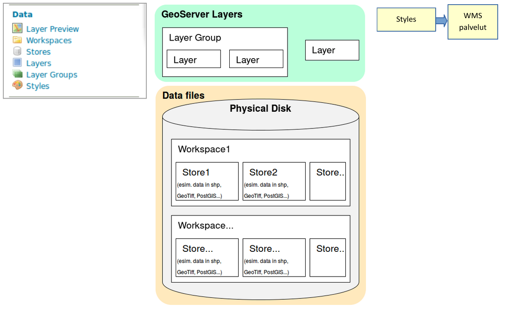

# HARJOITUS 1.2: GEOSERVERIN WEB-KÄYTTÖLIITTYMÄ

**Harjoituksen sisältö**

Harjoituksessa tutustutaan tarkemmin GeoServerin päätoimintoihin käyttöliittymän kautta. Käydään läpi käyttöliittymän eri osioiden päävalintoja ja tärkeimpiä ominaisuuksia.

**Harjoituksen tavoite**

Harjoituksen jälkeen opiskelija ymmärtää GeoServerin toimintaa ja eri osioiden hallintatyökaluja.

**Arvioitu kesto**

35 minuuttia.

## **Valmistautuminen**

Edellisessä harjoituksessa kävimme läpi osan GeoServerin web-käyttöliittymän valikoista. Näiden valikoiden ja toimintojen käyttäminen ei vaatinut sisäänkirjautumista. Tässä harjoituksessa kirjaudumme sisään GeoServerin web-käyttöliittymään ylläpitäjinä, jolloin meille avautuu enemmän valikkoja ja toimintoja.

## **Ylläpitäjän käyttöliittymä**

Tähän asti käyttöliittymällä on ollut näkyvissä vain kaikille avoimet toiminnallisuudet ja aineistot (ilman tunnistautumista). Näitä voidaan rajoittaa käyttäjäkohtaisesti eri pääsynhallinta-asetusten kautta. Pääsynhallinnan perusteisiin tutustutaan myöhemmin kurssilla.

Kirjaudu nyt palvelimeen käyttäen tunnuksena **admin** ja salasanana **gispo**.

::: hint-box
Psst! GeoServerin oletusasennuksessa salasana on 'geoserver', mutta koulutusta varten tämä on turvallisuussyistä vaihdettu.
:::

Ylläpitäjän näkymä muistuttaa äsken nähtyä käyttöliittymää. Sen rakenne on sama, mutta toiminnallisuuksia ja nähtävillä olevia tietoja on huomattavasti enemmän.

Päävalikosta löytyviä GeoServerin toimintoja on ryhmitelty niiden käyttötarkoituksen mukaan ryhmiin:

+--------------------------+----------------------------------------------------------------------------+
| ##### **About & Status** | Yleistä tietoa GeoServerin asennuksesta ja tilasta                         |
+==========================+============================================================================+
| ##### **Data**           | Sisältää aineiston lataamisen, määrittämisen ja kuvaustekniikan toimintoja |
+--------------------------+----------------------------------------------------------------------------+
| ##### **Services**       | Valikossa voi määritellä eri paikkatietopalvelujen ominaisuuksia           |
+--------------------------+----------------------------------------------------------------------------+
| ##### **Tile Caching**   | Karttatiilipalvelujen asetukset                                            |
+--------------------------+----------------------------------------------------------------------------+
| ##### **Security**       | Pääsynhallintaan liittyviä asetuksia                                       |
+--------------------------+----------------------------------------------------------------------------+
| ##### **Demos**          | Demo-toimintoja GeoServer-palvelujen testaamiseen                          |
+--------------------------+----------------------------------------------------------------------------+
| ##### **Tools**          | Palvelimen lisätyökaluja                                                   |
+--------------------------+----------------------------------------------------------------------------+

Näiden lisäksi Geoserverin laajennokset voivat lisätä valikkoja käyttöliittymään.

**Päävalikossa** on nyt uusia valikoita ja toiminnallisuuksia. 

Äskettäin läpikäydyt valikot ovat myös muuttaneet muotoaan. Niissä on nyt enemmän tietoa ja ne tarjoavat mahdollisuuden muokata erilaisia tietoja ja asetuksia.

::: hint-box
Psst! Huomaa, että nyt käyttöliittymän keskiosassa lukee myös "No Strong cryptography available...". Riippuen asennuksesta vahva salaus (strong cryptography)-toiminnallisuuden mahdollistaminen saattaa tarvita erillisen asennuksen (Java policy jar tiedostot).
:::

## **Master- ja Administrator-käyttäjät**

GeoServerin oletusasennuksessa on kaksi käyttäjäprofiilia, **master** ja **admin**. Salasanat on vaihdettu oletuksesta seuraavalla tavalla:

**Master** →  gispogispo

**Admin** →   gispo

::: hint-box
Psst! Ero master ja admin-käyttäjien välillä on se, että admin-käyttäjä on tarkoitettu käytettäväksi web-käyttöliittymän hallinnassa. Itse palvelimen asetusten muokkaamiseen käytetään master-käyttäjää, jolla on oikeudet päästä hallitsemaan GeoServerin root-asetuksia sekä suoraan palvelimella että web-käyttöliittymän kautta. Vältä näiden tunnusten käyttöä tuotannollisten palvelimien ylläpidossa.
:::

Näiden käyttäjien salasanat voi vaihtaa tarvittaessa pääsynhallinnan työkaluilla (**Security**-valikko).

## **About & Status -asetukset**

### **Contact Information**

Aloitetaan päivittämällä yhteystiedot. Valitse päävalikosta **About & Status → Contact Information**.

Täytä omilla tiedoilla ainakin kentät **Contact**, **Organization** ja **Email**.

Palataksesi **Welcome**-näkymään voit aina painaa **GeoServer-logoa** sivun vasemmasta yläreunasta.

### **Server Status**

Server Status -sivulla on tietoa erilaisista GeoServerin asetuksista ja tilasta. Huomaa esimerkiksi **Data directory** -kansion sijainti.

Kirjoita omiin muistiinpanoihisi (harjoituksen viimeinen sivu) palvelimesi **Data directory**:n sijainti.\
\

### **GeoServer Logs**

GeoServer Logs -valinnan kautta voit katsoa palvelimen lokitietoja. 

## **Data-valikko**

Tämä valikko sisältää GeoServerin tärkeimmät toiminnot. Aineistot lisätään ja määritellään näiden toimintojen avulla. Myös aineistojen esikatselu tapahtuu täällä olevia toimintoja käyttäen. Huomaa yhteydet valikon ja kuvassa esitellyn aineistojen järjestäytymisen välillä. 

**Styles** kohdassa määritellään tasoille (**Layers**) kuvaustekniikka, visualisointi. 

**Styles** (kuvaustekniikka) käytetään aina kun tasoja julkaistaan WMS-palveluna. Kuvaustekniikka ei ole riippuvainen tasoista: samaa kuvaustekniikkaa voidaan käyttää useilla tasoilla ja niillä voi olla useita valinnaisia kuvaustekniikoita.

### **Layer Preview**

Tämän valikon avulla on mahdollista esikatsella GeoServerillä julkaistuja karttatasoja.

Geoserverin oletusasennuksessa on julkaistu muutama demotaso, joita voi heti käyttää ja esikatsella.

 Tasojen lähtöaineisto voi olla rasteri tai vektori, formaatti on kuvattu näillä kuvakkeilla:

 Rasteri

 Piste (vektori)  Monikulmio (vektori)

 Viiva (vektori)  Tasoryhmä

Tason esikatselu aukenee OpenLayers-karttaikkunana uuteen selainikkunaan. Huomaa, että aineiston **OpenLayers**-esikatselussa on käytössä kuvaustekniikka, joka on määritelty GeoServerilla oletukseksi. Kuvaustekniikka-teemaan tutustutaan myöhemmin lisää.

Käyttämällä alasvetovalikkoa (**Select one**), voit myös ladata kyseisen tason eri tiedostomuodoissa (GeoTIFF, csv, shapefile\...).

### **Workspaces**

**Workspace** on GeoServerin tapa säilyttää ja järjestää viittaukset aineistoihin (**Stores**). Aineistot itse on tallennettu hakemistoon (tai tietokantaan), johon GeoServerillä on käyttöoikeudet.

Tyypillisesti samassa workspace:ssa pidetään samanlaisia ja/tai samasta lähteestä saatuja aineistoja. Esimerkiksi organisaation aineistot voidaan järjestää teemojen mukaan workspacen avulla (ymparisto, kaavoitus, vaesto, terveys, jne.)

Avaa **Workspaces**-valikko, muutama workspace on valmiiksi luotu GeoServerille:

Paina **Add new workspace**.

Luo uusi workspace, jota käytetään jatkossa koulutuksessa, anna sille nimi **helsinki** ja kirjoita **Namespace URI** -kohtaan [**http://gispo.fi/geoserver/helsinki**](http://gispo.fi/geoserver/helsinki):

Rastita vielä **Default Workspace**, niin jatkossa juuri luomasi workspace on oletuksena lisättäessä aineistoja ja tasoja GeoServeriin.

::: hint-box
Psst! URI (Uniform Resource Identifier) on teksti, joka määrittelee tietyn resurssin nimen. Se voi olla nettiosoite tai vaikka suhteellinen hakemisto kovalevystä. Ainoa vaatimus on se, että URI:n arvo on yksilöivä. Voit viitata esimerkiksi osoitteeseen tai kansioon, jossa on säilytetty workspaceen liittyvää dokumentaatiota.
:::

Paina **Submit** ja olet nyt lisännyt uuden workspacen Geoserverille.

Avaa äsken tekemäsi workspace painamalla **helsinki**-workspace **Workspace Name** -kohdan alta ja huomaa, että lisää valintoja on nyt saatavilla. Palataan niihin myöhemmin säädettäessä workspace-kohtaisia asetuksia.

Palaa **Workspace**-näkymään painamalla **Cancel**.

Workspaceja voidaan poistaa valitsemalla yksi tai useampi workspace ja painamalla **Remove selected workspace(s)** -toimintoa.

### **Stores**

Geoserverillä viitataan aineistolähteisiin **Storesien** avulla. Aineistolähteinä voivat olla yksittäiset tiedostot, tiedostoryhmät, hakemistot, tietokannat tai rajapintapalvelut.

Oletusasennuksessa on valmiina **Store**-viittauksia esimerkkiaineistoihin:

Jokaisen Storen vieressä on kuvake joka viittaa aineiston tyyppiin:

Tutustu muutamaan storen asetuksiin. Esimerkiksi **sfdem** viittaa rasteriaineistoon (huomaa kuvake) ja **taz_shapes** viittaa vektoriaineistoon.

Avaa sfdem-store ja taz_shapes-store. Kirjoita muistiinpanoihisi ylös vastaukset seuraaviin kysymyksiin:

::: hint-box
Mihin aineistoon sfdem-store viittaa?
:::

::: hint-box
Mihin aineistoon taz_shapes-store viittaa?
:::

Huomaa, että [**file:data/**](file:data/){.uri} viittaa Geoserverin Data Directory -hakemistoon. Hakemiston sijainti levyjärjestelmässä löytyy **About & Status → Server Status** -valikon kautta.

Store **taz_shapes** viittaa hakemistoon, jossa on useampia vektoriaineistoja, tässä tapauksessa .shp-tiedostoja.

Avaa vielä **taz_shapes**-store ja huomaa, että asetuksissa on rastittu **Enabled**. Se määrittää onko aineisto käytettävissä palvelimelta tai ei.

Toisin sanoen haluttaessa estää jonkin aineiston käyttöä GeoServerin kautta, ei tarvitse muuta kun jättää rastittamatta **Enabled**-valinta joko layer-, store- tai jopa workspace-valikossa.\

### **Layers**

Tasot (**Layers**) määrittelevät yhden aineistolähteen (**Store**) julkaisemisen ominaisuudet, kuten kuvaustekniikan, koordinaattijärjestelmän, metatiedot, palvelun ominaisuudet, karttatiilipalvelun (tile caching) määrittelyt jne.

Yksi taso vastaa yhtä aineistoa. Aineisto voidaan julkaista useisiin eri tasoihin, esimerkiksi eri kuvaustekniikoilla tms.

**Layers**-näkymässä on mahdollista muokata, lisätä tai poistaa tasoja. **Layers**-näkymän taulukossa on nähtävissä muutama taso ja niiden nimet (**Name**). Taulukossa lukee myös tason otsikko (**Title**) ja missä **Store**:ssa aineistot sijaitsevat.

Sarake **Enabled** näyttää tiedon siitä, onko taso käytettävissä palvelimelta vai ei. Huomaa, että käytettävyyden voi määritellä koko storelle (eli aineistolähteelle) tai erikseen tasoille (aineiston näkymille). Myös tason alkuperäinen koordinaattijärjestelmä on ilmoitettu taulukossa, **Native SRS**.

Avaa **Manhattan (NY) landmarks** -tason asetusten näkymä painamalla tason otsikkoa (**Title**) tai nimeä (**Name**) sarakkeesta. 

Tasoon liittyvät asetukset ovat laajat ja siksi ne on jaettu välilehtiin **Data**, **Publishing**, **Dimensions** ja **Tile Caching**. 

Tutustu nyt eri välilehtien asetuksiin saadaksesi kuvan siitä, miten tasot määritellään GeoServerillä. Keskustele niistä kouluttajan kanssa.

Tutustumme tarkemmin tasoasetuksiin myöhemmin, kun lisäämme omia aineistoja GeoServerille.

## **Layer Groups**

**Layer Groups** -toiminnolla muodostetaan tasoryhmiä. Tasoryhmien avulla on muodostetaan useammasta karttatasosta yhdistettyjä karttatasoja. Tasoryhmiin voidaan lisätä sekä karttatasoja että tasoryhmiä. Muun muassa tasojen järjestystä ja kuvaustekniikoita voidaan määrittää tasoryhmän asetuksissa.

## **Styles**

Avaa **Styles**-valikko, saat näkyviin listan GeoServerilla olevista kuvaustekniikoista.

Avaa **giant_polygon**-tyyli ja tutustu GeoServerin käyttämään kuvaustekniikkaformaattiin. Tasojen kuvaustekniikka määritellään käyttäen Styled Layer Descriptor (SLD) -kieltä.

Kuvaustekniikka on hyvin laaja aihe; siihen tutustutaan erikseen myöhemmin. Kuvaustekniikan toteuttamista voi helpottaa käyttämällä CSS-laajennosta, tätäkin käsitellään myöhemmin koulutuksessa.

## **Services**

GeoServerin rajapintapalvelujen (WFS, WMS ja WCS) yleisasetukset määritellään **Services**-valikon kautta; näihin tutustutaan tarkemmin myöhemmin.

## **Settings**

Tämä valikko sisältää erilaisia asetuksia kuten:

+--------------------------------------+-----------------------------------------------------------------------------+
| **Global**                           | Rajapintapalvelujen asetuksia ja lokitietojen asetuksia                     |
+--------------------------------------+-----------------------------------------------------------------------------+
| **Image Processing & Raster Access** | Asetukset kuvien ja raakakuva-aineiston (coverage) käsittelyyn palvelimessa |
+--------------------------------------+-----------------------------------------------------------------------------+

## **Tile Caching**

Tämän valikon kautta määritellään karttatiilipalvelujen (tile caching) asetuksia. Karttatiilipalveluihin tutustutaan tarkemmin myöhemmin.

## **Security**

Valikko sisältää GeoServerin pääsynhallintaan liittyvät asetukset. Huomaa, että muun muassa pääsynhallinta voidaan määrittää sekä käyttäjä-, ryhmä- ja roolikohtaisesti että aineisto- ja palvelukohtaisesti. Vilkaise nyt **Users**, **Groups, and Roles** -valikkoon.

Pääsynhallintaa käsitellään tarkemmin myöhemmin.
