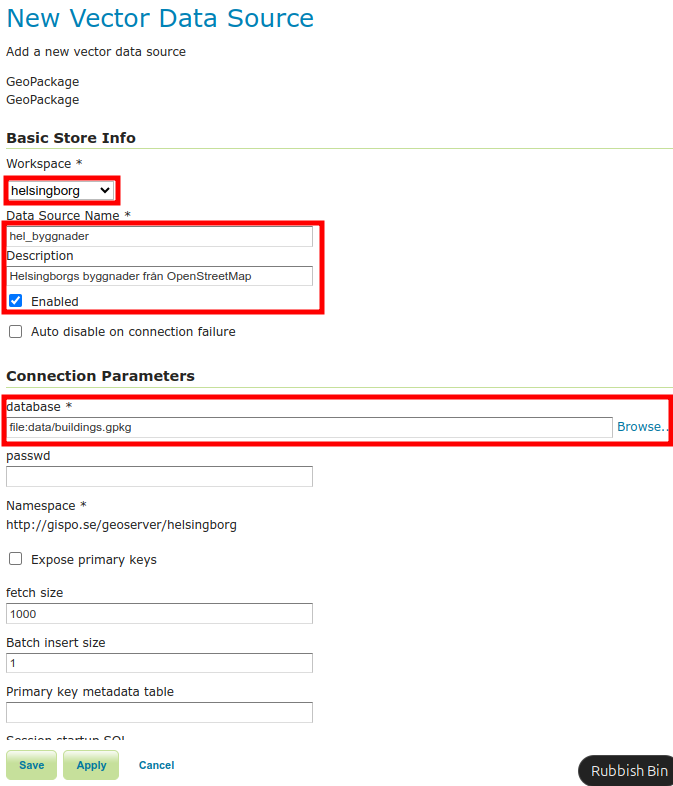

# Övning 1.3: VEKTORDATA

**Övningens innehåll**

I övningen lägger vi till vektordata i GeoServer och justerar inställningarna för lagret för att publicera det som en WFS-tjänst.

**Övningens syfte**

Efter övningen kommer studenten att kunna lägga till vektordata och kunna justera nödvändiga inställningarna för att publicera data.

**Tid**

40 minuter.

## **Förberedelser**

Allt material vi använder på kursen finns färdigt i en mapp på servern. Du kan kontrollera den specifika platsen i **Server Status**-sektionen, där det står **Data Directory**. Då nya data läggs till, hamnar de här.

Förutom geodata så finns det även andra filer i din **Data Directory**, som till exempel kartstilar och lagergruppers konfigureringsfiler. 

## **Skapa en Store för vektordata**

På servern finns färdigt OpenStreetMaps byggnader över Helsingborg som GeoPackage under namnet **buildings.gpkg**, som vi nu lägger till.

Välj **Stores** i huvudmenyn och tryck sedan på **Add new Store**.
Välj GeoPackage som datakällans format i **New data source**-sektionen, under **Vector Data Sources**.

I nästa vy kommer du att kunna definiera ytterligare inställningar för den store du just har skapat, såsom namn och filvägar. Namnge dem enligt följande:

-   **Välj** workspace som helsingborg
-   **Namnge** datasetet till hel_byggnader
-   **Lägg till** en beskrivning om du vill, till exempel "Helsingborgs byggnader från OpenStreetMap"

Nästa steg är att definiera vilket dataset (GeoPackage-fil) som ska refereras genom denna store. Justera **Connection Parameters**:

Klicka på **Browse...** och navigera till filen: **/data/buildings.gpkg**

Lämna **Enabled** markerat för att säkerställa att denna store
(och de lager som skapas från den) är tillgängliga från GeoServer-servern. Denna inställning kan användas för att dölja vissa dataset för användare utan att ta bort dem från servern (administratörer kan fortfarande använda dem).

Kontrollera att DBF charset är inställt på ISO-8859-1.

Övriga inställningar kan lämnas som de är.

Klicka på **Save** för att spara denna store i GeoServer.

Efter att en store har skapats förutsätter GeoServer att du vill publicera ett nytt lager, så en ny lager-vy (**New Layer**) öppnas automatiskt.

Välj **Publish** för att publicera lagret.

## **Publicering av vektorlager**

Låt oss nu skapa och publicera ett nytt lager. Om du inte redan gjort det, klicka på **Publish** så kan du ändra egenskaperna för det lager som ska publiceras.

::: hint-box
Psst! Om du råkat lämna föregående vy, kan du komma tillbaka till vyn för att skapa ett nytt lager genom att gå till huvudmenyn Layers \> Add a new layer och välja önskad store (i vårt fall helsingborg).
:::

Egenskaperna för publicering av lagret är indelade i fyra flikar:

-   **Data**

-   **Publishing**

-   **Dimensions**

-   **Tile Caching**

## **Datainställningar**

Nu fokuserar vi på **Data**-flikens innehåll. Justera följande inställningar:

-   **Håll** Enabled och Advertised ifyllda

-   **Namnge** lagret som "byggnader"

-   **Ge titeln** "Helsingborgs OpenStreetMap byggnader"

**Lägg till** en beskrivning av lagret och relaterade nyckelord (keywords) om du vill. Med hjälp av nyckelorden kan både Geoserver-administratörer och användare enklare hitta de geografiska data de behöver.

### **Coordinate Reference Systems**

Scrolla ner tills du hittar avsnittet **Coordinate Reference Systems**. Här anger du koordinatsystemet för lagret.

När du importerar nya data till GeoServer försöker den identifiera det ursprungliga koordinatsystemets EPSG-kod. Om identifieringen misslyckas blir värdet i fältet **Native SRS** UNKNOWN, och till höger om det finns en länk som du kan använda för att få information om det ursprungliga koordinatsystemet för datasetet.

I detta fall kommer projektioninformationen från GeoPackage-filen. Klicka på länken EPSG:WGS84... för att öppna projektioninformationen.

::: hint-box
Psst! Observera att uppgifterna i Native SRS är endast avsedda för förhandsgranskning. Informationen hämtas direkt från den ursprungliga datakällans inställningar. Därför kan dessa uppgifter inte redigeras via GeoServers webbanvändargränssnitt.
:::

Lägg till vid behov **EPSG:4326-koden** under Declared SRS. Du kan även söka efter EPSG-koder med **Find**-funktionen.

Behåll **SRS handling**-inställningen på standardvärdet (**Force declared**).

### **Bounding Boxes**

Fyll i uppgifterna om lagrets geografiska omfattningen under avsnittet **Bounding Boxes**.

::: hint-box
Psst! 
Bounding boxen kan bestämmas automatiskt, men GeoServer kräver att denna inställning görs manuellt. Anledningen är att med stora datamängder kan servern fastna länge i att beräkna lagrens omfattning. Förfrågan kan till och med misslyckas om serverns timeout-inställning överskrids, vilket skulle försvåra att lägga till data.
:::

Datamängden för övningen är så liten att vi kan använda automatisk bestämning. Tryck först på **Native Bounding Box → Compute from data** och sedan **Lat/Lon Bounding Box → Compute from native bounds**.

### **Feature Type Details**

I den nedre delen av **Data**-sektionen finns **Feature Type Details**, där du kan se egenskaperna och typerna för vektordata.

Andra publiceringsinställningar kommer vi att gå igenom senare. Klicka på **Save** nu, så att lagret blir tillgänglig i GeoServer. Kontrollera att det nya lagret **byggnader** finns med på lagerslistan.

::: hint-box
Psst! Du kan använda "sök"-funktionen för att filtrera vyn.
:::

Avaa nyt **Layer Preview** -näkymä, jolla pääset esikatselemaan **rakennukset**-tasoa samalla tavalla kun aiemmin olet esikatselut muita demoaineistoja.

Öppna nu **Layer Preview**-vyn, där du kan förhandsgranska lagret **byggnader** på samma sätt som du tidigare förhandsgranskat andra demodata.

::: hint-box
Psst! Huomaa, että Layer Preview näkymässä (ja myös Layer näkymässä) tason nimen edessä on laitettu workspacen nimi. Helsingin rakennukset -tason nimi on siksi helsinki:rakennukset.

Observera att i Layer Preview-vyn (och även i Layer-vyn) har workspacens namn lagts till framför lagrets namn. Därför är namnet helsingborg:byggnader.
:::

OpenLayers förhandsgranskning ser ut så här: 

Zooma in på kartan och klicka på en byggnad för att visa dess egenskapsinformation.

## **Lägg till Helsingborgs vägnät**

Lägg till OpenStreetMap Helsingborgs vägnät till GeoServer på samma sätt som i den tidigare övningen. Datasetet finns i samma mapp som byggnader-datasetet, under namnet vagnat.gpkg.

Kom ihåg att innan du kan lägga till lagret i GeoServer måste du skapa en lämplig store. Namnge denna nya store
**hel_vagnat** och det skapade lagret **"vagnat"** så att lagernamnen förblir konsekventa. Kontrollera också koordinatsystemet (**EPSG:4326**) och DBF charset (**ISO-8859-1**).